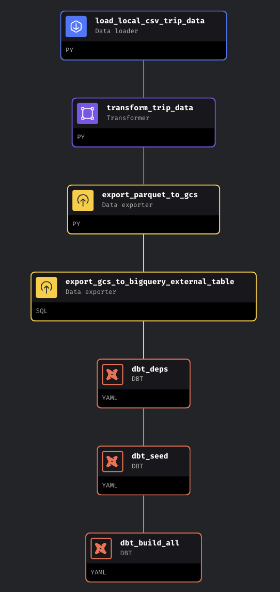
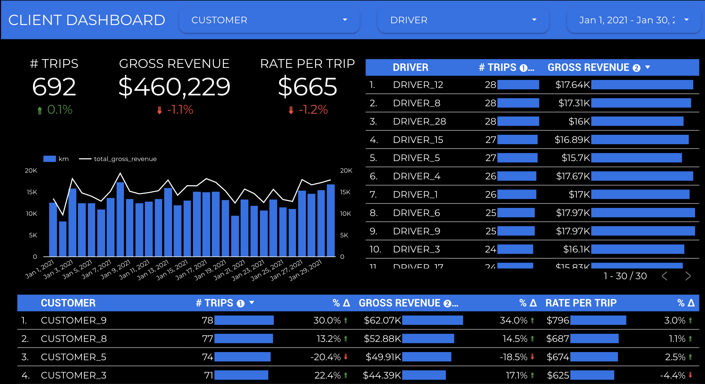

<<<<<<< HEAD
# Data_Engineering_Project_Real_Time
This project delivers a full ETL pipeline for a truck logistics company to track revenue and performance. Using Terraform for GCP infrastructure, MAGE for orchestrated ETL, dbt for analytics in BigQuery, and Looker Studio for dashboards, it provides executives with clear, actionable insights.
=======
# Truck Logistics Data Pipeline 

## Data Engineering Zoom Camp | 2024 Cohort | Capstone Project 

Author: [*Diego Gutierrez*](https://www.linkedin.com/in/diego-gutierrez-1874b17b/) 

  >**IMPORTANT;** _to skip the project overview & head staight to set up, click [here](setup.md)_

-------

-----

## Table of Contents:

* [Problem Statement](#problem-statement)
* [Tools & Technology](#tools--technology)
* [Architecture Diagram](#architecture-diagram)
* [Data Sources & Schema](#data-sources--schema)
* [Mage Orchestration](#mage-orchestration)
* [Dashboard & Visualization](#dashboard--visualization)
* [Further Ideas & Next Steps](#further-ideas--next-steps)
* [Acknowledgements & Credits](#acknowledgements--credits)

    >**NOTE;** _to skip the project overview & head staight to set up, click [here](setup.md)_

------------------------

### Problem statement 

The necessity for developing a pipeline and dashboard for a truck logistics company stems from the imperative to efficiently collect, process, and disseminate critical information regarding transportation activities, especially revenue data from each customer. By establishing a comprehensive pipeline, which encompasses data acquisition, preprocessing, analysis, and visualization stages, alongside a user-friendly dashboard interface tailored for executives and senior management, the company can access accurate insights into revenue generation, cost analysis, and overall operational performance.

This project is a full ETL (Extract, Transform, Load) pipeline designed to streamline and enhance the data processing capabilities of a truck logistics company. The project leverages several powerful technologies and tools to achieve its objectives:

- Infrastructure Provisioning with Terraform: Terraform is used to create the necessary cloud infrastructure on Google Cloud Storage and BigQuery, ensuring a scalable and reliable environment for data processing and storage.

- Data Orchestration with MAGE: MAGE, an advanced data orchestrator, is employed to automate the ETL process. It downloads a CSV file from the local machine, transforms it into a Parquet file, and loads it into Google Cloud Storage and BigQuery. This entire process is containerized and runs inside Docker, providing consistency and ease of deployment.

- Analytics with dbt: dbt (Data Build Tool) is used to perform analytics on the data stored in BigQuery. This enables the creation of meaningful data models and transformations that drive deeper insights into the logistics operations.

- Visualization with Looker Studio: Finally, Looker Studio is used to create interactive and user-friendly dashboards. These dashboards present key metrics and insights, enabling executives and senior management to make informed decisions based on real-time data.

______________________________________________

### Tools & Technology

* Containerisation: [Docker](https://www.docker.com/)
* Workflow Orchestration: [Mage](https://www.mage.ai/)
* Data Transformations: [DBT DataBuildTools](https://www.getdbt.com/)
* Data Lake: [Google Cloud Storage](https://cloud.google.com/storage/?hl=en)
* Data Warehouse: [Google BigQuery](https://cloud.google.com/bigquery?hl=en)
* Infrastructure as Code (IaC): [Terraform](https://www.terraform.io/) 
* Visualisation: [Looker Studio](https://lookerstudio.google.com/)

______________________________________________

### Architecture Diagram

------------------------

### Data Sources & Schema

The project was inspired by a truck fleet company that has drivers working for different companies. The data was simulated to avoid using private data. The simulated data used in this project can be found in the 'data' and 'seed' directories. To generate similar data, you can run the Python script [`data_generator.py`](data/data_generator.py).

There are basically 2 CSV files: one located in the local 'data' folder, which is supposedly updated every week with the week's rides, and a fixed table containing customer rates for each type of trip.

1. trip_data: This CSV contains trip data for truck logistics. It includes the following columns:

* date: The date of the record.
* driver: The name of the driver.
* customer: The name of the customer.
* hours: The number of hours for the trip.
* km: The distance traveled in kilometers.

2. customer_rates: This CSV provides information about different rates for customers. It includes the following columns:

* customer: The name of the customer.
* hour_city: The hour rate for city trips.
* hour_regular: The hour rate for regular trips.
* hour_hy: The hour rate for highway trips.
* fsc_city: The fuel surcharge rate for city travel.
* fsc_regular: The fuel surcharge rate for regular travel.
* fsc_hy: The fuel surcharge rate for highway travel.
* hy_mileage: The highway mileage rate.

______________________________________________

### Mage Orchestration

Mage operates within code blocks, and this pipeline utilizes Python, SQL, and DBT blocks in the following sequence:

1. Load CSV file from local directory.
2. Perform transformations and create a Parquet file.
3. Export the Parquet file to Google Cloud Storage.
4. Create an external table in BigQuery using the Parquet file from the Google Cloud Storage bucket.
5. Install all dbt packages with dbt deps.
6. Seed the customer_rates file into the DBT project.
7. Create all DBT models.
    - Create staging models for both files, with additional columns such as tripid and trip_type for trip_data.
    - Create core model by joining both staging models and calculating revenue according to customer rules.

-----------------------------

### Dashboard & Visualization 

A dashboard has been developed using Google Looker Studio to visualise truck logistics events. Utilising Google's native visualisation tool from within BigQuery, the dashboard benefits from enhanced speed and reduced latency. This synergy between Looker and BigQuery allows for efficient data retrieval and processing, leading to faster insights and smoother user experiences.

Dashboard Link: [HERE](https://lookerstudio.google.com/s/pBt7UHZBg1k)

-----------------------------

### Further Ideas & Next Steps

- Use a larger dataset
- Create customer_rates files separated by year
- With more data it would be possible to use tools such as dlt
- Use partitions and clustering

-----------------------------

### Acknowledgements & Credits

Acknowledgement to [DataTalksClub](https://datatalks.club/)! for mentoring us through the Data Engineering Zoom Camp over the last 10 weeks. It has been a privilege to take part in the Spring '24 Cohort, go and check them out!
 
> "DataTalks.Club - the place to talk about data! We are a community of people who are passionate about data. Join us to talk about everything related to data, to learn more about applied machine learning with our free courses and materials, to discuss the engineering aspects of data science and analytics, to chat about career options and learn tips and tricks for the job interviews, to discover new things and have fun!

> Our weekly events include:

> 👨🏼‍💻 Free courses and weekly study groups where you can start practicing within a friendly community of learners

> 🔧 Workshops where you can get hands-on tutorials about technical topics

> ⚙️ Open-Source Spotlight, where you can discover open-source tools with a short demo video

> 🎙 Live Podcasts with practitioners where they share their experience (and the recordings too)

> 📺 Webinars with slides, where we discuss technical aspects of data science"

[Data Talks Club](https://www.linkedin.com/company/datatalks-club/)

---------------------------
>>>>>>> 0ddd028 (Initial commit)
